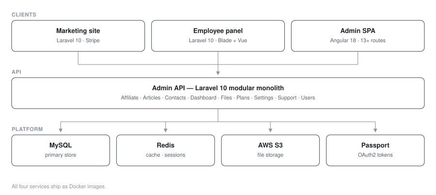

# StaffViz — Workforce Management SaaS

**Workforce SaaS · Laravel 10 + Angular 18 · 4 services**

An HR platform covering employee self-service, subscription plans, affiliates and support — four Dockerised services backed by a modular API split into nine independent domains.

> **Source code is private.** This repository documents the architecture and engineering work.

## My role
Full-stack engineer

## Architecture

| Service | Stack | Responsibility |
|---|---|---|
| Admin API | Laravel 10, `nwidart/laravel-modules` | Domain logic, split into 9 isolated modules |
| Employee panel | Laravel 10, Blade, Vue | Self-service portal for staff |
| Admin SPA | Angular 18, RxJS, CKEditor 5 | 13+ routed admin screens |
| Marketing site | Laravel 10, Stripe | Public site, plan checkout, geolocation |

All four ship as Docker images.

### Service topology

## Engineering highlights

**Modular monolith.** The API is decomposed into nine self-contained modules — `Affiliate`, `Articles`, `Contacts`, `Dashboard`, `Files`, `Plans`, `Settings`, `Support`, `Users` — each with its own routes, migrations, service providers and `composer.json`. Modules can be enabled per tenant without touching the core, which kept feature work isolated as the product grew.

**OAuth2 + token auth.** Laravel Passport issues tokens for first-party panels; Sanctum covers lighter session flows.

**AI-assisted content.** OpenAI integration (`openai-php/client`) in the employee panel for generated copy and summarisation.

**Operational hardening.** Redis-backed caching and sessions, S3 (`league/flysystem-aws-s3-v3`) for user uploads, scheduled encrypted backups via `spatie/laravel-backup`, and per-request query logging for performance triage.

**Angular 18 admin.** Standalone-component architecture with `@angular/cdk`, `ng-bootstrap`, CKEditor 5 with a custom upload adapter, and date-range pickers for reporting.

## Screenshots

<!--  -->
<!--  -->
<!--  -->

_Screenshots pending — see `docs/README.md`._

## Stack

`Laravel 10` · `PHP 8` · `Angular 18` · `TypeScript` · `Vue` · `MySQL` · `Redis` · `Docker` · `AWS S3` · `Stripe` · `Passport` · `OpenAI`
